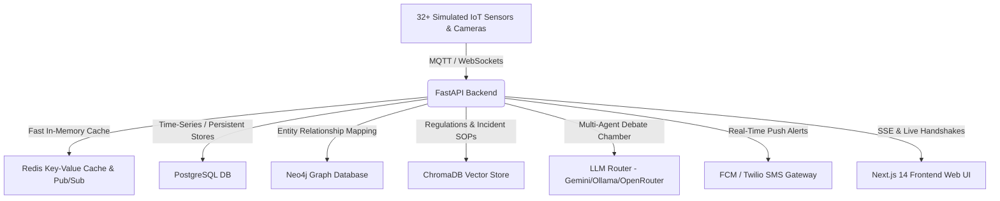

# 🏭 SafetyOS — AI Industrial Safety Operating System
### *Real-time Compound Risk Engine, Multi-Agent Deliberation & Autonomous Regulatory Compliance*
---
[](LICENSE)
[](https://nextjs.org/)
[](https://fastapi.tiangolo.com/)
[](docker-compose.yml)

**SafetyOS** is a comprehensive, enterprise-ready industrial safety solution built for high-risk environments (Refineries, Chemical Plants, Steel Complexes, and Pharma Manufacturing). It automates real-time compliance tracking against **OISD** (Oil Industry Safety Directorate) standards and the **Factories Act 1948** (India). 

By combining real-time telemetry, computer vision inference, vector RAG, and an autonomous multi-agent AI debate chamber, SafetyOS prevents major industrial disasters before they manifest.

---

## 📺 Application Previews & Architecture



---

## ✨ Primary Feature Showcases

### 1. 🛑 Compound Risk Correlation (Rule Engine)
- Combines disparate non-critical indicators to detect severe cumulative risks (e.g., active confined space permit in Zone C + rising H2S levels + overdue maintenance schedules).
- Real-time calculations with automatic risk scaling (0-100%).

### 2. 🧠 Multi-Agent AI Safety Debate Chamber
- 6 specialized AI agents (Safety, Production, Compliance, Maintenance, Finance, Emergency) debate critical risk triggers in real-time.
- Synthesized by an **Executive AI** to deliver immediate, legally-compliant recommendations, mitigating downtime vs safety cost trade-offs.

### 3. ⚖️ Continuous Compliance Monitor
- Continuously maps sensor telemetry and permit scopes against Indian regulatory codes (OISD-105, OISD-116, Section 36 of Factories Act 1948).
- Automatically prompts safety officers with required corrective actions.

### 4. 📖 Smart CCTV & PPE Vision Pipeline
- Bounding box overlay tracking for PPE compliance (hard hats, safety vests) and restricted area intrusions.
- Direct push notifications and alerts linked to specific worker records.

### 5. 🔍 Knowledge Graph & Vector RAG
- Interactive entity relationship graph linking hazards, permits, regulations, and workers.
- Context-aware voice/text search tool referencing OISD manuals and historical failure incident files.

---

## 🛠️ Complete Local Deployment

Ensure you have **Docker** and **Docker Compose** installed on your machine.

### 1. Quick Boot (Windows PowerShell)
```powershell
./run.ps1
```

### 2. Manual Boot (Linux / Mac / Windows Command Prompt)
```bash
# Clone the repository
git clone https://github.com/brovk2008/SENTINEL-X.git
cd SENTINEL-X

# Create environments
copy .env.example .env

# Boot the Docker stack
docker-compose up --build -d
```
The frontend is available at `http://localhost:3000` and the backend is serving at `http://localhost:8000`.

---

## 🔬 Validation & Auditing Scripts

SafetyOS includes automated scripts to check stack health and generate seed test data.

### 1. Zero Trust Audit (Health Check)
Verifies all 5 layers of the stack: port checks, backend routes, data integrity, frontend SSR pages, and real-time WebSocket telemetry.
```bash
python zero_trust_audit.py
```

### 2. Synthetic Data Generator
Generates a complete Vizag Unit 3 refinery dataset: 32 active sensors, 50 workers, 30 permits, 52 historical failure incidents, and pushes mock crisis telemetry to check trigger flows.
```bash
# Export mock seed datasets
python synthetic_data_generator.py --export

# Push crisis alerts directly to the running backend
python synthetic_data_generator.py --push
```

---

## 📦 Technology Stack
* **Frontend UI**: Next.js 14, React, Zustand State Store, Recharts, Tailwind CSS.
* **Backend API**: FastAPI, Uvicorn, Python Paho MQTT, Asyncpg.
* **Vector Store**: ChromaDB (RAG embedding storage).
* **Graph DB**: Neo4j (Entity relationships).
* **Database**: PostgreSQL (Persistency) & Redis (Real-time pub/sub cache).
* **AI Engine**: Google Gemini API, OpenRouter, and local Ollama integrations.

---

## 📄 License
This project is licensed under the MIT License - see the [LICENSE](LICENSE) file for details.
