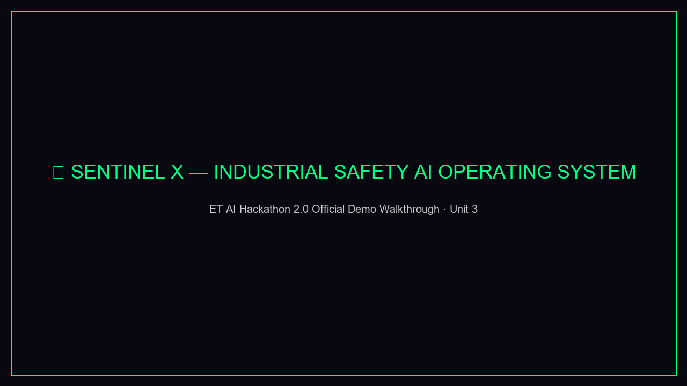
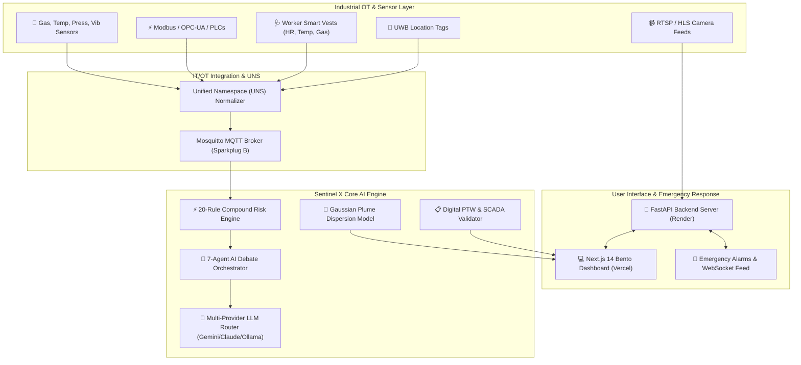

<p align="center">
  
</p>

<h1 align="center">🏭 Sentinel X — Industrial Safety AI Operating System</h1>

<p align="center">
  <strong>Autonomous IT/OT Convergence, Real-Time Compound Risk Intelligence, Multi-Agent AI Debate & Worker Biometrics for High-Risk Industrial Plants</strong>
</p>

<p align="center">
  <a href="https://sentinel-x-pearl.vercel.app"></a>
  <a href="frontend/public/demo_video.mp4"></a>
  <a href="frontend/public/demo_video.gif"></a>
  <a href="https://sentinel-x-52xs.onrender.com/docs"></a>
  <a href="https://github.com/brovk2008/SENTINEL-X"></a>
  <a href="LICENSE"></a>
</p>

<p align="center">
  
</p>

---

## 📌 Executive Summary

Modern industrial facilities—petrochemical refineries, steel mills, and chemical processing units—operate complex machinery under hazardous conditions. Today, industrial safety systems are fragmented into isolated silos: SCADA handles process telemetry, physical permits are filed separately, gas detectors alert locally, and worker tracking is manual.

When multiple subtle anomalies happen simultaneously (e.g., a low-level toxic gas weep during confined space maintenance while an adjacent compressor exhibits abnormal vibration), traditional systems fail to correlate the compound hazard, leading to catastrophic industrial disasters.

**Sentinel X** bridges this gap by acting as an autonomous **AI Operating System for Industrial Safety**. It normalizes industrial IoT data into a **Unified Namespace (UNS)**, continuously correlates multi-vector hazards through a **20-Rule Compound Risk Engine**, streams real-time consensus via a **7-Agent AI Debate Engine**, tracks worker physiological strain via smart biometrics, models atmospheric gas plume dispersion, and validates Permit-to-Work (PTW) compliance against live SCADA telemetry.

---

## 🚀 Key Innovation Highlights

### 🤖 1. Multi-Agent AI Debate Engine
When a high-risk safety incident occurs, Sentinel X triggers an autonomous debate between **6 specialized domain AI agents + 1 Executive Decision Agent**:
- 🔴 **Safety Agent**: Prioritizes life protection and mandatory evacuation thresholds.
- 🟡 **Production Agent**: Evaluates operational downtime costs and partial isolation alternatives.
- ⚖️ **Compliance Agent**: Enforces strict OISD & Factories Act statutory mandates.
- 🔧 **Maintenance Agent**: Diagnoses root-cause mechanical failure signatures and repair timelines.
- 💰 **Finance Agent**: Calculates ROI of proactive shutdown vs. catastrophic liability.
- 🚨 **Emergency Agent**: Mobilizes response teams, exclusion zones, and protocol activation.
- 📊 **Executive Agent**: Synthesizes all perspectives and renders an authoritative, decisive operational verdict.

### ⚡ 2. 20-Rule Compound Risk Correlation Engine
Goes beyond single-sensor threshold alarms by detecting multi-variable hazard interactions:
- **H₂S Buildup + Active Confined Space Permit**
- **Hot Work Permit + Downwind Adjacent LEL Flammable Gas Spike**
- **Lockout/Tagout (LOTO) Verification Failure + Active Maintenance**
- **Worker Fatigue (>12h Shift) + High-Hazard Overcrowded Zone**
- **Vibration Anomaly + Overdue Mechanical Calibration Cascade**

### 🩺 3. Worker Wearable Biometric Intelligence
- Computes Moran et al. **Physiological Strain Index (PSI)** (0–10 scale) using real-time heart rate and core/skin body temperature telemetry.
- Evaluates **WBGT Heat Index** and calculates cumulative **OSHA TWA/STEL gas dosimetry** for H₂S and CO exposure per worker.

### 💨 4. Gaussian Hazard Plume Dispersion Modeling
- Implements atmospheric **Pasquill-Gifford dispersion models** using Briggs rural coefficients.
- Dynamically projects **ERPG-2/3 & OISD hazard boundaries** on SVG plant floor overlays, adjusting in real-time to wind direction, release rate, and stability classes.

### 🚶 5. Real-Time Location System (RTLS) & Exclusion Geofencing
- Ultra-Wideband (UWB) worker coordinate tracking on interactive plant floor maps.
- Automated 2-second evaluation loops checking confined space permit access and active machinery exclusion zones.

### 📋 6. SCADA-Integrated Digital PTW Validator
- Calculates a 3-vector **Vulnerability Index (VI)**: $\text{VI} = \text{Location Score} \times \text{Job Criticality} \times \text{Human Strain}$.
- Validates isolation status and verifies training records against OISD-105, OISD-116, OISD-118, and Factories Act 1948 requirements.

### 🔑 7. Multi-Provider LLM & Custom Key Settings Interface
- Built-in provider router supporting **Google Gemini 2.0**, **OpenRouter**, **Anthropic Claude 3.5**, and **Local Ollama** models.
- Includes a dedicated **Settings Page (`/settings`)** allowing operators to configure custom API keys and test connections at runtime.

---

## 🏗️ System Architecture



---

## 📱 Application Modules & Pages (17 Routes)

| Page Route | Module Name | Core Features |
|---|---|---|
| **`/`** | **Mission Control** | Live plant operations feed, real-time risk ring, sensor ticker, compound risk alerts. |
| **`/debate`** | **AI Debate Chamber** | Streaming multi-agent safety debate reasoning with interactive scenario controls. |
| **`/sensors`** | **Sensors Console** | Matrix of 10+ real-time plant sensors with sparklines and historical charts. |
| **`/cameras`** | **CCTV Vision** | Computer vision AI feed overlay with object detection and PPE monitoring. |
| **`/permits`** | **Digital PTW** | Automated permit verification engine with Vulnerability Index scoring. |
| **`/biometrics`** | **Worker Biometrics** | Fleet physiological strain index (PSI) gauges, heart rate, and gas dosimetry. |
| **`/dispersion`** | **Hazard Plume** | Real-time atmospheric toxic plume model with ERPG contour map overlays. |
| **`/workers`** | **RTLS Tracking** | UWB plant floor positioning map, geofence breaches, and machinery exclusion zones. |
| **`/compliance`** | **Regulatory Hub** | Real-time statutory compliance audit against OISD and Factories Act rules. |
| **`/simulator`** | **Scenario Simulator** | What-if risk simulation matrix for testing compound hazard escalation. |
| **`/executive`** | **Executive Briefing** | AI Copilot assistant and executive shift report generator. |
| **`/knowledge`** | **RAG Knowledge Base** | Vector semantic search over OISD regulations, SOPs, and incident archives. |
| **`/sites`** | **Multi-Site Overview** | Geographical map overview across multiple industrial refinery locations. |
| **`/connect`** | **Connectivity Manager** | Protocol connector settings for MQTT, OPC-UA, Modbus, and RTSP. |
| **`/handover`** | **Shift Handover Log** | Digital shift change log with pending permit tracking and AI summary. |
| **`/settings`** | **Settings & API Keys** | **Custom LLM API Key manager** (Gemini, OpenRouter, Claude, Ollama) with live test suite. |

---

## 🛠️ Technology Stack

- **Frontend**: Next.js 14 (App Router), TypeScript, React 18, Zustand, Recharts, Lucide Icons, Vanilla CSS (Claymorphism & Spatial Bento UI).
- **Backend**: FastAPI, Python 3.11, Asyncio, Pydantic v2, Uvicorn, Starlette.
- **AI / LLM & ML**: Google Gemini API, OpenRouter API, Anthropic API, Ollama, PyTorch, OpenCV, ChromaDB (Vector Search).
- **Industrial IoT Protocols**: MQTT (Sparkplug B), OPC-UA, Modbus TCP, RTSP / HLS Video Streaming.
- **Infrastructure & Deployment**: Docker, Docker Compose, Vercel (Frontend), Render (Backend).

---

## ⚖️ Supported Industrial Standards

- **OISD-105**: Work Permit System & Gas Clearance Limits
- **OISD-116**: Fire Protection Facilities for Petroleum Refineries
- **OISD-118**: Inspection of Heavy Rotating Equipment
- **OISD-GDN-206**: Safety Management System in Petroleum Industry
- **Factories Act 1948**: Sections 36 (Confined Space), 37 (Explosive Gas), 41F (Hazardous Processes)
- **OSHA 1910.119**: Process Safety Management (PSM) of Highly Hazardous Chemicals

---

## ⚡ Quickstart & Local Development

### Prerequisites
- Node.js 18+ & npm
- Python 3.11+
- Git

### 1. Clone Repository
```bash
git clone https://github.com/brovk2008/SENTINEL-X.git
cd SENTINEL-X
```

### 2. Frontend Setup
```bash
cd frontend
npm install
npm run dev
```
Open `http://localhost:3000` in your browser.

### 3. Backend Setup
```bash
cd backend
python -m venv venv
# On Windows:
.\venv\Scripts\activate
# On Linux/macOS:
source venv/bin/activate

pip install -r requirements.txt
uvicorn main:app --reload --port 8000
```
API server will run at `http://localhost:8000`. Access Swagger UI at `http://localhost:8000/docs`.

### 4. Docker Compose Setup (Optional)
Run the entire stack including Postgres, Redis, Mosquitto MQTT, and API via Docker:
```bash
docker-compose up -d
```

---

## 🌐 Production Deployment

- **Frontend Web App**: Deployed on **Vercel** at [`https://sentinel-x-pearl.vercel.app`](https://sentinel-x-pearl.vercel.app)
- **Backend API**: Deployed on **Render** at [`https://sentinel-x-52xs.onrender.com`](https://sentinel-x-52xs.onrender.com)

---

## 📄 License

Distributed under the MIT License. See [`LICENSE`](LICENSE) for details.

---

<p align="center">
  Built for the <strong>ET AI Hackathon 2.0</strong> | <i>Sentinel X — The factory has a brain.</i>
</p>
